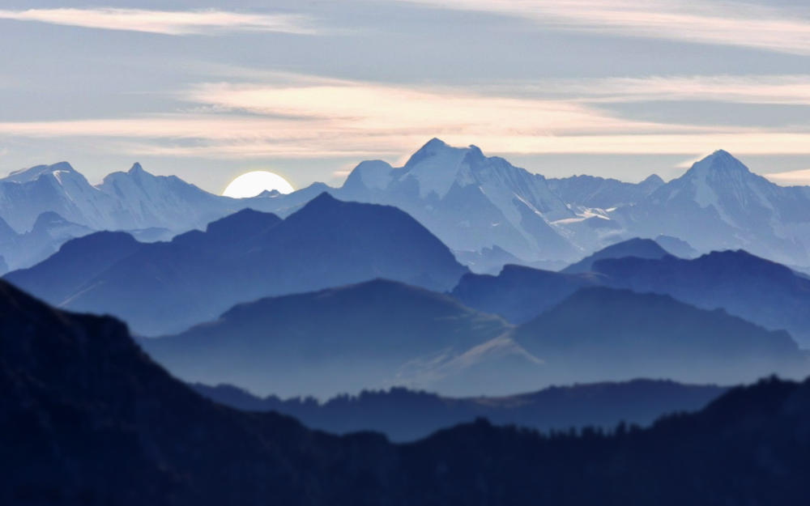

# Blue Mountains 3D Paralax

## JS Animation

Working example: https://raff1010x.github.io/38.Blue-Mountains--3D-Paralax/

My git repo: https://github.com/Raff1010X/01.Roadmap

## BUG

Sometimes after page reload images are shifted and white bockground is visible.

Mouse move event triggers multiple images downloads. 

You can see it in network tab in dev tools.